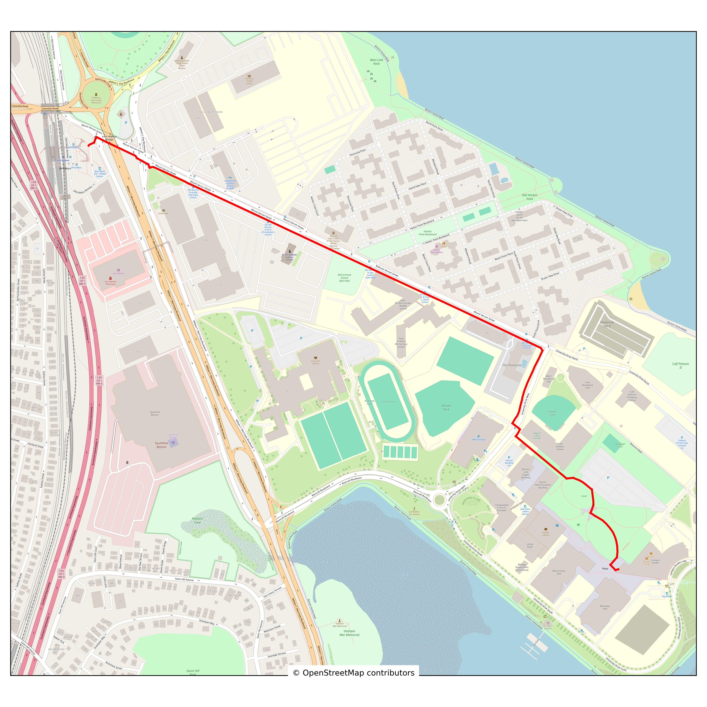

<br />
  <p align="center">
    
  <h1 align="center">BeaconNav</h1>
  <p align="center" class="h6"> CS310 Team 1 Spring 2025 Final Project</p>
  <p align="center"></p>
</p>


:globe_with_meridians: Finds optimal pedestrian routes on a geographic graph using pathfinding algorithms

## :link: Table of Contents
<details>
<summary> Click to expand</summary>

- [About](#octocat-about)
- [Installation](#computer-installation)
- [Usage](#atom-usage)
- [Example](#dart-example)
- [Results](#bar_chart-results)

</details>

## :octocat: About
**BeaconNav** is a geographic pathfinding tool that computes the shortest pedestrian route between two user-selected points within a bounded region of the UMass Boston area.

The pedestrian network is retrieved from [OpenStreetMap](https://wiki.openstreetmap.org/wiki/Overpass_API) using the 'overpy' API. We define the campus area using a polygonal boundary:

```python
UMB_REGION = [
  (42.3198, -71.0525),
  (42.3202, -71.0519),
  ...
]
```

> [!NOTE]
> The bounded region includes the UMass Boston campus and extends toward the JFK/UMass station area.
>

This region defines the search space used by the pathfinding algorithms:
- Dijkstra's algorithm
- A* Search


## :computer: Installation
Install dependencies:
```bash
python3 -m venv venv
source venv/bin/activate
pip install -r requirements.txt
```


## :atom: Usage
To run the project, use the following command:
```bash
python3 src/main.py
```

## :dart: Example

``` bash
$ python3 src/main.py
please enter your starting location: university hall
please enter your ending location: mccormack hall
please choose an algorithm ('dijkstra', 'astar'): astar

Computing shortest path using A* algorithm...

Expanded nodes: 36
0.0036 seconds
Estimated walk time: 3.5 minutes
Walking distance: 0.18 miles
```

>[!IMPORTANT]
>To generate and view the plotted path map, the 'cartopy' library (listed in 'requirements.txt') must be installed.
>


## :bar_chart: Results

Both A* and Dijkstra's algorithms successfully compute the shortest path. However, A* significantly outperforms Dijkstra in terms of efficiency by expanding fewer nodes.

Although they produce the same optimal path, in one case A* expanded approximately ~85% fewer nodes than Dijkstra. This demonstrates how informed search using a heuristic function (such as great-circle distance) can substantially reduce computational effort.
