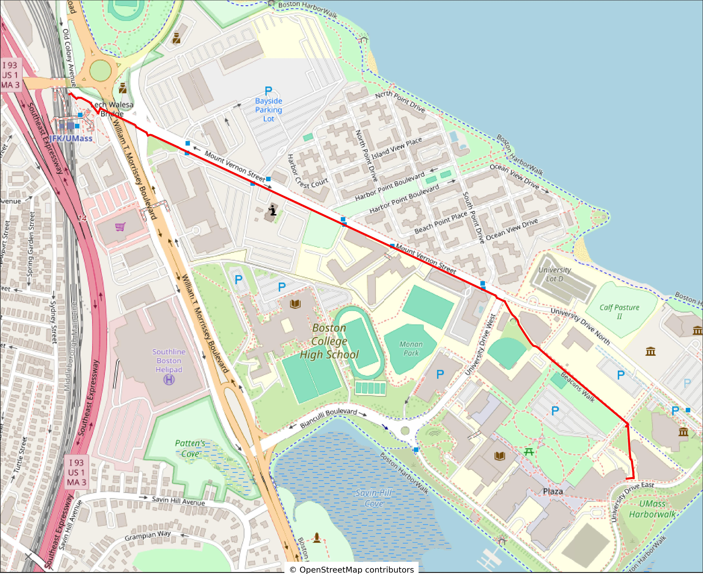

# CS310

Pedestrian directions for the UMass Boston campus.
 


## Running the Project
to install the dependencies
```bash
python3 -m venv venv
source venv/bin/activate
pip install -r requirements.txt
```
to run the project run ``python3 src/main.py``